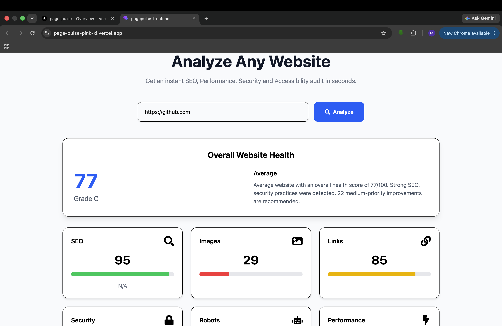
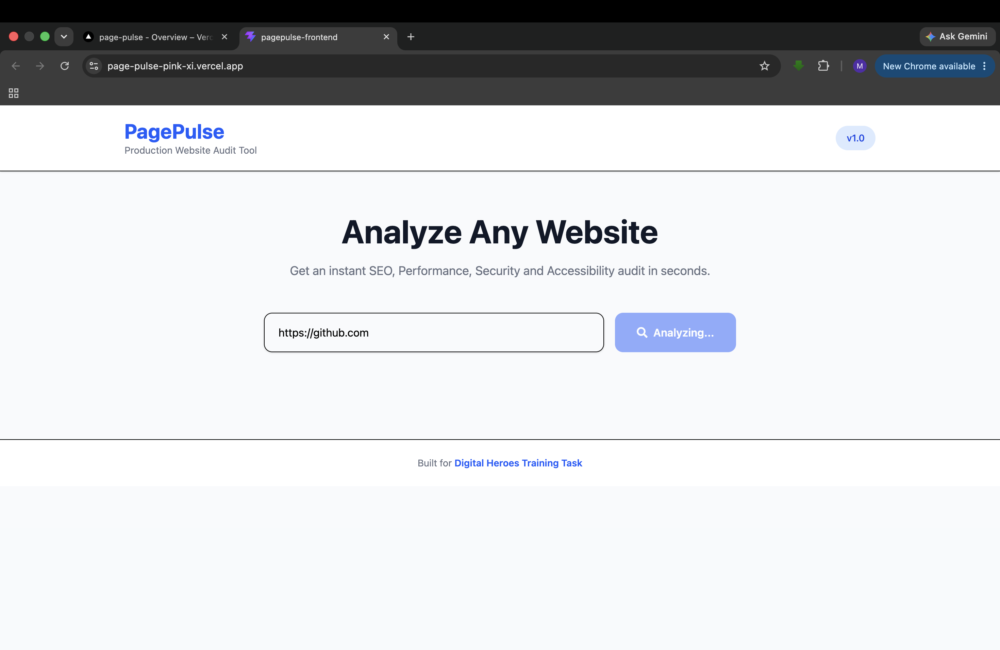
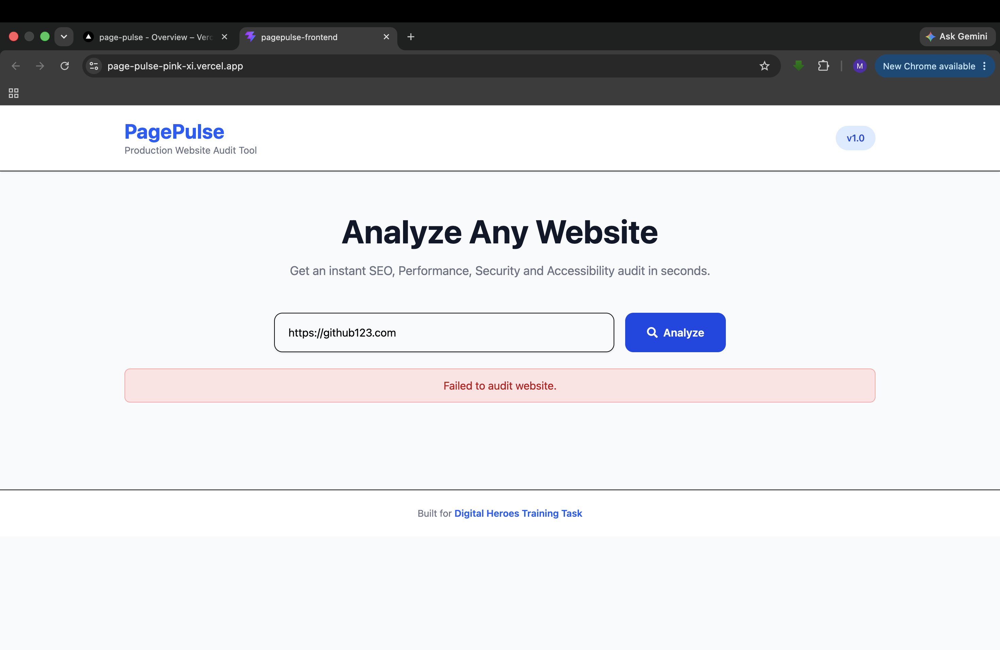

# 🚀 PagePulse

**PagePulse** is a modern web application that analyzes websites and provides insights into their **performance, accessibility, SEO, security, and best practices**. It offers a clean, responsive interface where users can submit a website URL and receive a detailed audit report in seconds.

---

## 🌐 Live Demo

- **Frontend:** https://page-pulse-pink-xi.vercel.app/
- **Backend API:** https://pagepulse-api-6zky.onrender.com
- **Health Check:** https://pagepulse-api-6zky.onrender.com/health

---

## ✨ Features

- 🔍 Analyze any publicly accessible website
- ⚡ Real-time website audit
- 📊 Performance metrics visualization
- ♿ Accessibility score
- 🔒 Security checks
- 🔎 SEO analysis
- 📱 Fully responsive UI
- ⏳ Loading indicators
- ❌ Error handling for invalid URLs
- 🌐 RESTful API architecture

---

## 🛠️ Tech Stack

### Frontend
- React 19
- Vite
- Tailwind CSS v4
- Axios
- React Router DOM
- React Icons

### Backend
- Node.js
- Express.js
- Lighthouse
- Puppeteer
- Pino Logger

### Deployment
- Frontend: Vercel
- Backend: Render

---

## 📁 Project Structure

```
Page_Pulse/
│
├── backend/
│   ├── src/
│   ├── package.json
│   └── ...
│
├── frontend/
│   ├── src/
│   ├── public/
│   ├── package.json
│   └── ...
│
└── README.md
```

---

## ⚙️ Installation

### Clone the Repository

```bash
git clone https://github.com/<YOUR_USERNAME>/page-pulse.git

cd Page_Pulse
```

---

## Backend Setup

```bash
cd backend

npm install

npm run dev
```

Backend runs on:

```
http://localhost:5000
```

---

## Frontend Setup

```bash
cd frontend

npm install

npm run dev
```

Frontend runs on:

```
http://localhost:5173
```

---

## Environment Variables

### Backend (.env)

```env
PORT=5000

# Add your required environment variables here
```

### Frontend (.env)

```env
VITE_API_URL=http://localhost:5000/api/v1
```

For production:

```env
VITE_API_URL=https://pagepulse-api-6zky.onrender.com/api/v1
```

---

## API Endpoints

### Health Check

```
GET /health
```

### Website Audit

```
POST /api/v1/audit
```

Example Request

```json
{
  "url": "https://example.com"
}
```

---

## Screenshots

### Home Page


```
/screenshots/home.png
```

### Audit Result



```
/screenshots/result.png
```

---
### Loading State



---

### Error Handling



---

## 🚀 Deployment

### Frontend

Deployed on **Vercel**

### Backend

Deployed on **Render**

---

## 🧪 Running Tests

Backend

```bash
cd backend

npm test
```

---

## Future Improvements

- Authentication
- Audit history
- Export reports as PDF
- Dashboard with analytics
- Dark mode
- Rate limiting
- Caching

---

## Author

**Manish Chaudhary**

GitHub: https://github.com/manish1730

LinkedIn: <YOUR_LINKEDIN_PROFILE>

---

## License

This project was developed as part of a **Software Development Internship Assessment** and is intended for educational and evaluation purposes.